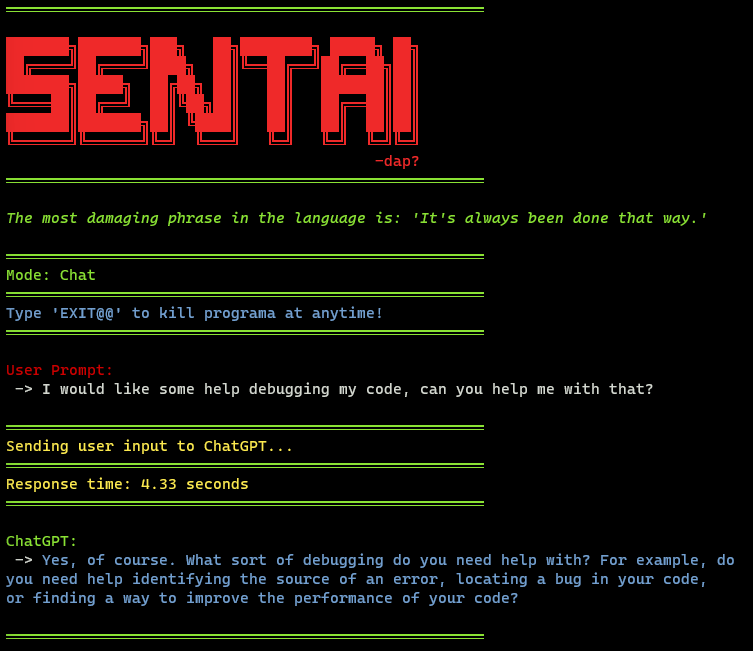

# sentAI ChatGPT Terminal



### This project allows users to interact with OpenAI's ChatGPT via the terminal. Users can choose between a chat mode and a programming assist mode.
  - Note: many features might not be implemented yet, but they will come...
### It is also a work in progress so dont complain if it breaks while I am still adding features.

# Prerequisites

- Python 3.6 or higher
- An OpenAI API key

# Installation

## 1. Clone the repository:
```
git clone https://github.com/literallynotdap/sentAI.git
```
## 2. Enter the project directory:
```
cd sentAI
```
## 3. Create a virtual environment to isolate the dependencies for your project:

### - On Windows:
```
python -m venv venv
```
### - On macOS and Linux:
```
python3 -m venv venv
```
## 4. Activate the virtual environment:

### - On Windows:
```
venv\Scripts\activate
```

### - On macOS and Linux:
```
source venv/bin/activate
```

## 5. Install the required packages from `requirements.txt`:
```
pip install -r requirements.txt
```
## 6. Create a `.env` file in the project directory and add your OpenAI API key (or use the one provided in this repo):
```
OPENAI_API_KEY=your_api_key_here
```
### Replace `your_api_key_here` with your actual OpenAI API key.

## Usage

## To run the project, execute the following command:
```
python sentai.py -i
```
- This will start the program in interactive mode. You will be prompted to choose between chat mode (1) and programming assist mode (2). Type the corresponding number to select a mode and follow the on-screen instructions.

```
To exit the program at any time, type 'EXIT@@' and press Enter.
```


